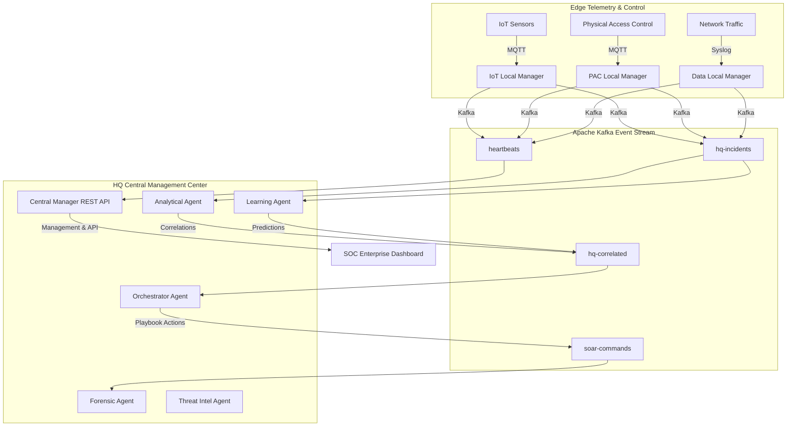

# 🛡️ MASS: A Predictive Cyber-Physical Security System

> **MASS** (Predictive Cyber-Physical Security System) is a multi-agent, enterprise-grade Security Operations Center (SOC) designed to detect, analyze, correlate, and autonomously mitigate hybrid cyber-physical threats in real-time.

---

## 🏗️ System Architecture & Data Flow



---

## 📁 Repository Directory Structure

```text
├── 📁 HQ (central manager)/        # Centralized Campus Management Center
│   ├── 📁 analytical_agent/       # Event correlation and multi-stage attack detection
│   ├── 📁 learning_agent/         # Machine learning threat prediction models
│   ├── 📁 orchestrator_agent/     # SOAR orchestration and automated playbook execution
│   ├── 📁 central_manager/        # Central API aggregator, incident tracker & status monitor
│   ├── 📁 forensic_agent/         # Automated evidence and host-level snapshot gathering
│   ├── 📁 ti_agent/               # Threat intelligence processor
│   ├── 📁 common/                 # Shared Kafka clients, models, and security libraries
│   └── 📁 docker/                 # Centralized Dockerfiles and docker-compose deployment files
│
├── 📁 dashboards/                 # Frontend Visualization Panels
│   ├── 📁 hq_dashboard/           # Rich Campus SOC Dashboard (overview, twin, threat prediction)
│   └── 📁 local_manager_dashboard/ # Placeholder for building-level local dashboards
│
├── 📁 agents/                     # Telemetry agents deployed across the network
│   ├── 📁 advanced/               # advanced edge forensic and TI agents
│   ├── 📁 data_network/           # NDR / EDR traffic telemetry collectors
│   ├── 📁 iot/                    # Behavioral monitoring and gateway agents
│   └── 📁 physical_access/        # Credential anomaly & Physical Access Control (PAC) agents
│
├── 📁 network/                    # Network segmentation and infrastructure configs
│   ├── 📁 Switches/               # Core switches configuration files
│   └── 📁 Routers/                # Router ACLs and routing configurations
│
├── 📁 local-managers/             # Building-level managers (IoT, PAC, Data)
├── 📁 collectors/                 # Edge telemetry and logs ingestion scripts
├── 📁 hardware/                   # Physical CAD/wiring specifications
├── 📁 pi/                         # Edge code running on Raspberry Pi controllers
└── 📁 serverroom/                 # Virtualization and Pi-hole configurations
```

---

## ⚡ Core Components

### 1. `HQ (central manager)`
* **`central_manager`**: A FastAPI application that gathers telemetry, aggregates logs from all active agents, and exposes real-time data to the SOC dashboard.
* **`analytical_agent`**: Monitors Kafka feeds to correlate physical breaches (e.g., restricted area door violations) with cyber anomalies (e.g., unauthorized SSH connections) to detect multi-stage attack patterns (e.g., MITRE ATT&CK Kill-Chains).
* **`learning_agent`**: Enriches security incidents with machine-learning-based predictions (such as next-hop propagation and confidence scoring).
* **`orchestrator_agent`**: The Security Orchestration, Automation, and Response (SOAR) engine. It initiates pre-defined security playbooks (e.g., isolating a compromised VLAN, locking down doors, blocking attacker IPs).
* **`forensic_agent`**: Triggers automated evidence capture, taking process snapshots and logs from target hosts during high-severity incidents.
* **`ti_agent`**: Feeds real-time IP blacklists, malware hashes, and known bad domains to the correlation engine.

### 2. `dashboards/hq_dashboard`
An interactive Single-Page-Application (SPA) built using React/JSX containing:
* **Digital Twin**: 3D and 2D layouts of campus environments.
* **Attack Path Predictions**: Visual forecasts showing high-probability targets.
* **Incident Correlation Feed**: Combined view of data networks, physical access controls, and IoT domains.
* **SOAR Automation Logs**: Real-time checklist showing active playbooks and executed commands.

### 3. `network/`
Contains real-world Cisco/Arista network configurations representing secure campus network infrastructure:
* **`Switches/`**: Port maps, VLAN segmentations, and access control policies.
* **`Routers/`**: NAT rules, site-to-site VPNs, and WAN interfaces.

---

## 🚀 Getting Started

### Prerequisites
* **Docker & Docker Compose**
* **Python 3.8+**
* **Apache Kafka**

### Quickstart Deployment (HQ Services)

1. **Start the Infrastructure** (Kafka, Zookeeper, Mosquitto, PostgreSQL):
   ```bash
   cd "HQ (central manager)/docker"
   docker-compose up -d
   ```

2. **Install Python Dependencies**:
   ```bash
   cd "../"
   pip install -r ti_agent/requirements.txt
   ```

3. **Run Central Manager API**:
   ```bash
   python server.py
   ```

4. **Launch the SOC Dashboard**:
   Open `dashboards/hq_dashboard/soc_enterprise.html` in your browser.
