<div align="center">

<br/>


# Multi-domain Autonomous Security System

### *A Predictive Cyber-Physical Security Platform for Near-Real-Time Threat Detection and Autonomous Control*

<br/>

[](https://github.com/graduationprojecthm2026-sudo/A-Predictive-Cyber-Physical-Security-System-for-Near-Real-Time-Threat-Detection-and-Autonomous-Cont/actions)


<br/>

> **28 seconds** autonomous detection-to-isolation vs **11 minutes** manual baseline
> **3 domains** · **15 agents** · **1 unified incident** · **0 human intervention required**

<br/>

*Galala University — Faculty of Computer Science and Engineering, 2026*
*Supervisor: Prof. Samay Ghoniemy*

</div>

---

## Table of Contents

- [What is MASS?](#what-is-mass)
- [The Research Contribution](#the-research-contribution)
- [System Architecture](#system-architecture)
- [The Three Domains](#the-three-domains)
- [Agent Roster](#agent-roster)
- [Intelligence & AI/ML Layer](#intelligence--aiml-layer)
- [Network Infrastructure](#network-infrastructure)
- [Server Room & Infrastructure](#server-room--infrastructure)
- [Hardware — IoT & PAC](#hardware--iot--pac)
- [SOC Dashboards](#soc-dashboards)
- [SOAR — Autonomous Response](#soar--autonomous-response)
- [Kafka Event Bus](#kafka-event-bus)
- [Deployment — Logical to Physical Map](#deployment--logical-to-physical-map)
- [Getting Started](#getting-started)
- [Design vs PoC](#design-vs-poc)
- [Team](#team)

---

## What is MASS?

MASS is a **distributed, multi-agent security platform** that monitors three domains simultaneously — data network, IoT, and physical access control — and autonomously responds to threats without requiring a human in the loop.

Commercial security products are domain-siloed: CrowdStrike protects endpoints, Darktrace watches networks, Genetec manages physical access. **None correlate across all three.** MASS does.

When an unknown RFID card is presented at a door *while* a simultaneous port scan arrives from the same actor, no individual alert is conclusive. MASS fires a single `physical_cyber_combo CRITICAL` incident with confidence `0.97` — a correlated attack narrative that a SOC analyst can act on immediately, rather than three disconnected alerts they'd have to manually link.

```
┌─────────────────────────────────────────────────────────────────────────┐
│                          MASS IN 30 SECONDS                             │
│                                                                         │
│  00s  Attack begins on student PC (port scan + credential dump)         │
│  03s  NDR + EDR agents detect — alerts on data.alerts Kafka topic       │
│  08s  Data Local Manager correlates, Risk Score crosses threshold       │
│  12s  Incident escalated to HQ → hq.incidents                          │
│  17s  Analytical Agent fires correlated CRITICAL incident               │
│  21s  Orchestrator selects intrusion_response playbook                  │
│  25s  SOAR Executor SSHes to Core-SW, pushes ACL isolation entry        │
│  28s  Student PC loses campus connectivity. Dashboard shows ISOLATED.   │
│                                                                         │
│  Manual equivalent: ~11 minutes.                                        │
└─────────────────────────────────────────────────────────────────────────┘
```

---

## The Research Contribution

The **Analytical Agent** is what makes MASS novel. It performs **cross-domain correlation** across IoT, PAC, and Data Network domains into a single unified incident — something no commercial product does.

| What makes it unique | How it works |
|---|---|
| Cross-domain correlation | Sliding time windows (5 min + 30 min) across all three domain alert streams |
| Kill-chain mapping | MITRE ATT&CK stage sequencing with confidence escalation |
| Attack graph | NetworkX-powered per-actor incident graph; campaign detection when graph exceeds N nodes |
| Predictive risk scoring | Cumulative weighted scoring catches patient attackers who stay below every individual signature threshold |

```
WITHOUT MASS                    WITH MASS
─────────────────               ──────────────────────────────────────
Alert 1: Unknown RFID card  ──► physical_cyber_combo CRITICAL [0.97]
Alert 2: Port scan              ONE incident, ONE correlated narrative,
Alert 3: NDR brute force        ONE analyst action required.
   ↓
3 disconnected tickets
SOC analyst spends ~11 min
linking them manually
```

---

## System Architecture

MASS is organized in **three tiers** running across **three security domains**.

```
┌──────────────────────────────────────────────────────────────────────────────────┐
│                         TIER 3 — HQ INTELLIGENCE                                │
│                         Arwa's laptop · 192.168.12.10 · VLAN 12                 │
│                                                                                  │
│   ┌──────────────────┐  ┌──────────────────┐  ┌──────────────────┐              │
│   │  Central Manager │  │ Analytical Agent │  │  Orchestrator    │              │
│   │     :8020        │  │     :8006        │  │     :8007        │              │
│   │  Incident hub    │  │  Cross-domain    │  │  SOAR playbooks  │              │
│   │  Agent health    │  │  correlation ★   │  │  soar.commands   │              │
│   └──────────────────┘  └──────────────────┘  └──────────────────┘              │
│   ┌──────────────────┐  ┌──────────────────┐  ┌──────────────────┐              │
│   │  Learning Agent  │  │    TI Agent      │  │  Forensic Agent  │              │
│   │     :8008        │  │     :8009        │  │     :8021        │              │
│   │  Adaptive thresh │  │  IOC enrichment  │  │  Evidence bundle │              │
│   │  Real precision  │  │  SQLite 24 IOCs  │  │  Kafka-replay    │              │
│   └──────────────────┘  └──────────────────┘  └──────────────────┘              │
└───────────────────────────────────▲────────────────────────────────────────────-┘
                                    │  hq.incidents  ·  agents.heartbeats
┌───────────────────────────────────┼────────────────────────────────────────────-┐
│                        TIER 2 — LOCAL MANAGERS                                  │
│                        Malak's laptop · 192.168.40.10 · VLAN 40                 │
│                                                                                  │
│   ┌──────────────────┐  ┌──────────────────┐  ┌──────────────────┐              │
│   │  Data Local Mgr  │  │  IoT Local Mgr   │  │  PAC Local Mgr   │              │
│   │     :8012        │  │     :8010        │  │     :8011        │              │
│   │  Risk scoring ★  │  │  Isolation Fores │  │  Badge analytics │              │
│   │  soar_executor   │  │  score passthru  │  │  lock_door cmds  │              │
│   └──────────────────┘  └──────────────────┘  └──────────────────┘              │
└───────────────────────────────────▲────────────────────────────────────────────-┘
                                    │  data/iot/pac.alerts
┌───────────────────────────────────┼────────────────────────────────────────────-┐
│                         TIER 1 — EDGE AGENTS                                    │
│                                                                                  │
│  DATA NETWORK           IoT DOMAIN              PHYSICAL ACCESS                 │
│  ─────────────          ─────────────           ───────────────                 │
│  NDR Agent :8004        Gateway Agent :8000     PAC-EDA Agent :8002             │
│  EDR Agent :8005        Behavioral    :8001     Cred Anomaly  :8003             │
│  (auto-deployed)        Isolation Forest ML     6 RFID rules                    │
│  UEBA baselines         MQTT→Kafka bridge       SHA-256 UIDs                    │
└──────────────────────────────────────────────────────────────────────────────────┘
                                    │
                         Apache Kafka · 192.168.60.10:9092
```

<div align="center">

**Full system topology:**

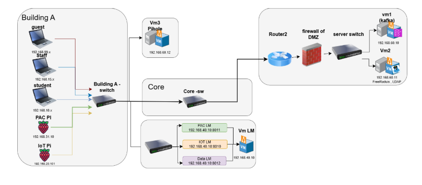

**End-to-end data flow:**

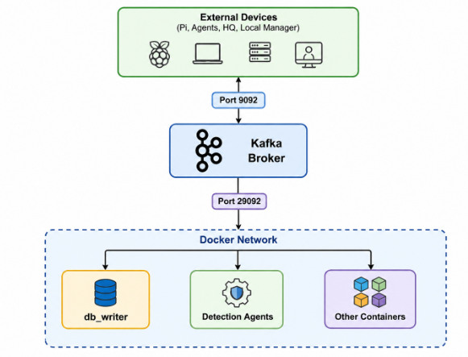

**Telemetry pipeline:**


</div>

---

## The Three Domains

### 🔵 Data Network Domain — VLANs 10 / 15

Protects student PCs (VLAN 10) and staff laptops (VLAN 15). NDR and EDR agents auto-deploy from VM2 via `auto_deploy.py` and self-redeploy within 30 seconds if killed — closing the agent-blinding attack surface.

<div align="center">


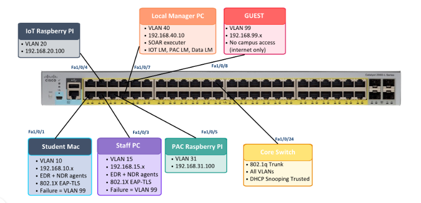

</div>

**Detection coverage — 9 NDR rules, 7 EDR rules, all MITRE-mapped:**

| Agent | Detection | MITRE | Threshold |
|---|---|---|---|
| NDR | Port scan | T1046 | 20 dst_ports / 60s |
| NDR | SSH brute force | T1110 | 10 failed / 60s |
| NDR | Data exfiltration | T1048 | ≥ 50 MB to external IP |
| NDR | Lateral movement | T1021 | 3+ VLANs / 120s |
| NDR | C2 beaconing | T1071 | 5 small flows / 5 min |
| NDR | DNS tunneling | T1071 | 20+ DNS / 60s or non-Pi-hole |
| NDR | After-hours activity | T1036 | 5+ flows between 00:00–06:00 |
| EDR | Credential dump | T1003 | /etc/shadow, lsass, keychain |
| EDR | Ransomware | T1486 | 3+ .locked files OR 200+ bulk ops / 30s |
| EDR | Privilege escalation | T1548 | Root process, non-root parent |
| EDR | Persistence | T1053 | LaunchAgents, cron, rc.local writes |

---

### 🟢 IoT Domain — VLAN 20

Physical sensor monitoring with machine learning anomaly detection. The Behavioral Agent runs **Isolation Forest** (scikit-learn) — the primary ML component.

**Sensors:** DHT22 (temperature/humidity), MQ-2 (gas/smoke), PIR (motion), fire system agent.

**Why Isolation Forest over threshold rules:** A 35°C reading alone may be normal. At 3 AM with no motion and elevated gas — it is anomalous. Isolation Forest learns the multi-dimensional normal; threshold rules cannot.

<div align="center">

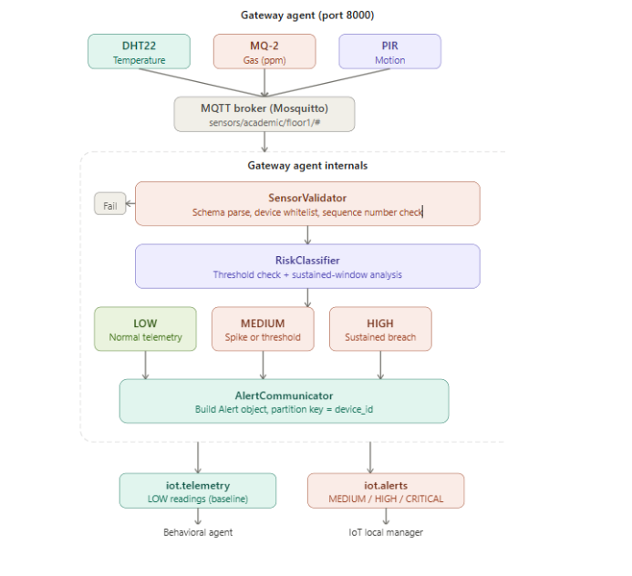

</div>

| Detection | Trigger |
|---|---|
| `high_temperature` | DHT22 above learned normal range |
| `gas_leak` | MQ-2 spike |
| `motion_anomaly` | PIR motion in unexpected time/location |
| `device_offline` | Sensor stops reporting heartbeat |
| `sensor_tamper` | Combined-signal Isolation Forest anomaly |

---

### 🔴 Physical Access Control Domain — VLAN 31

RC522 RFID reader, relay-controlled solenoid lock, buzzer, and SW-420 vibration tamper sensor on a Raspberry Pi 5. Card UIDs are SHA-256 hashed before LDAP lookup — a packet capture of `pac.events` reveals no raw credentials.

**Six PAC-EDA detection rules:**

| Rule | Trigger | Severity | SOAR Action |
|---|---|---|---|
| `unknown_card_attempt` | UID not in LDAP | HIGH | deny · notify · flag UID |
| `after_hours_access_attempt` | Access after 20:00 | MEDIUM | deny · notify security |
| `tailgating_detected` | Same UID twice in 5s | HIGH | notify · camera review |
| `brute_force_badge_attempt` | 5+ denied / 60s | CRITICAL | lock door · block card |
| `badge_cloning_detected` | Same UID on 2 readers simultaneously | CRITICAL | lock all doors · isolate zone |
| `unauthorized_area_access` | Valid card, wrong zone | MEDIUM–HIGH | deny · notify |

---

## Agent Roster

| # | Agent | Domain | Host | Port | ML/AI |
|---|---|---|---|---|---|
| 1 | NDR Agent | Data Network | Student/Staff PC | 8004/8007 | UEBA statistical baselines |
| 2 | EDR Agent | Data Network | Student/Staff PC | 8005/8006 | Signature + behavioral |
| 3 | Gateway Agent | IoT | VM1 | 8000 | None (protocol bridge by design) |
| 4 | Behavioral Agent | IoT | VM1 | 8001 | **Isolation Forest (primary ML)** |
| 5 | PAC-EDA Agent | PAC | VM1 | 8002 | Rule-based, 6 rules |
| 6 | Credential Anomaly Agent | PAC | VM1 | 8003 | Per-user behavioral baselines |
| 7 | Data Local Manager | Data Network Tier 2 | Malak laptop | 8012 | Risk Scoring Engine |
| 8 | IoT Local Manager | IoT Tier 2 | Malak laptop | 8010 | Score passthrough |
| 9 | PAC Local Manager | PAC Tier 2 | Malak laptop | 8011 | Lock recommendation |
| 10 | Central Manager | HQ | Arwa laptop | 8020 | Agent health (60s heartbeat) |
| 11 | Analytical Agent | HQ | Arwa laptop | 8006 | **Cross-domain correlation ★** |
| 12 | Orchestrator Agent | HQ | Arwa laptop | 8007 | Playbook selection |
| 13 | Learning Agent | HQ | Arwa laptop | 8008 | Adaptive thresholds + cosine similarity |
| 14 | TI Agent | HQ advanced | Arwa laptop | 8009 | IOC enrichment (24 seeded) |
| 15 | Forensic Agent | HQ advanced | Arwa laptop | 8021 | Kafka-only evidence bundles |

> **★ The Research Contribution** — the Analytical Agent performs cross-domain correlation that no commercial product replicates.

---

## Intelligence & AI/ML Layer

MASS uses five complementary intelligence layers. Each catches what the layer above it would miss.

### 1 — Isolation Forest (IoT Behavioral Agent)

```python
# scikit-learn unsupervised anomaly detection
# feeds: temperature, gas, motion, time-of-day simultaneously
# 30-minute cold-start calibration → online detection
from sklearn.ensemble import IsolationForest
model = IsolationForest(contamination=0.05, random_state=42)
model.fit(calibration_readings)
score = model.decision_function([live_reading])
# score below threshold → iot.alerts published
```

**Why unsupervised:** No labeled training data needed. Anomalies are "easier to isolate" — they land in shallower trees because they are rare and different.

<div align="center">


</div>

### 2 — UEBA Statistical Baselines (NDR Agent)

Per-device learning: normal ports, mean/std-dev of bytes per flow, active hours. After 100 samples the baseline is frozen. Any flow deviating beyond 3σ fires a behavioral anomaly — catches the "living off the land" attacker who stays under signature thresholds.

### 3 — Predictive Risk Scoring (Data Local Manager)

```
Patient attacker scenario:
  8 SSH attempts     → +40 pts  (threshold is 10, no alert fired)
  15-port scan       → +30 pts  (threshold is 20, no alert fired)
  2 AM access        → +20 pts  (threshold is 5 flows, no alert fired)
  ─────────────────────────────────────────────────────────────────
  Total: 90 pts  →  HIGH threshold crossed → PREEMPTIVE SOAR isolation
```

Score decays exponentially; stale signals fade. Three thresholds: Warning (50), High (100), Critical (150 — triggers isolation before any signature fires).

### 4 — Adaptive Thresholds (Learning Agent)

Every confirmed/dismissed SOC analyst decision becomes a labeled sample. Real precision = TP / (TP + FP) computed per detection type. Threshold recommendations published to NDR/EDR via `soar.commands` at runtime — no agent restart needed. Outputs `not_yet_computed` until 10+ labeled samples exist (no fake metrics).

<div align="center">

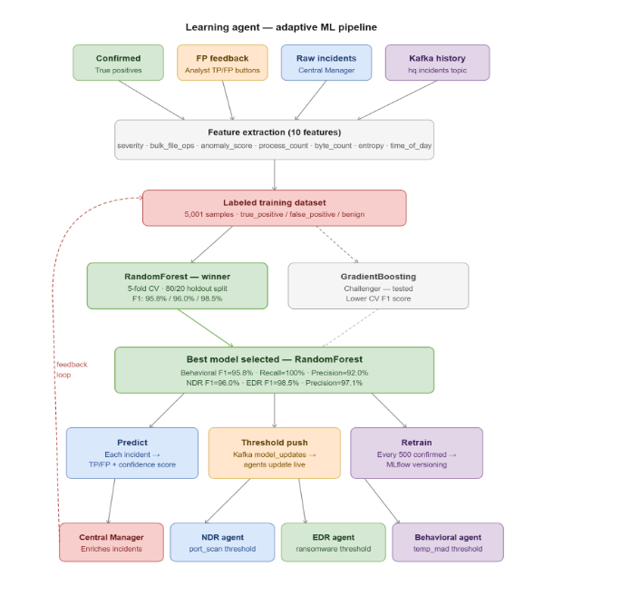

</div>

### 5 — MITRE ATT&CK Kill-Chain Mapping

Every alert across all agents carries a MITRE technique ID and numeric confidence. The Analytical Agent sequences incidents into kill-chain stages (Recon → Initial Access → Lateral Movement → Exfiltration). Confidence escalates as more stages appear in the same time window.

<div align="center">

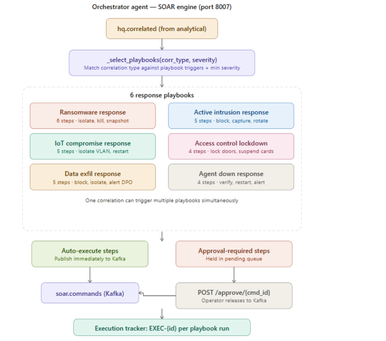


</div>

---

## Network Infrastructure

### Campus Topology

<div align="center">

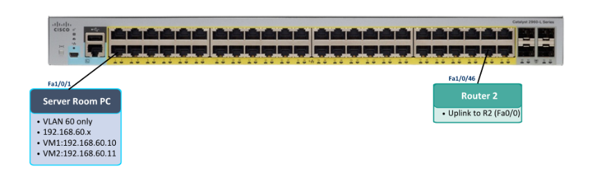

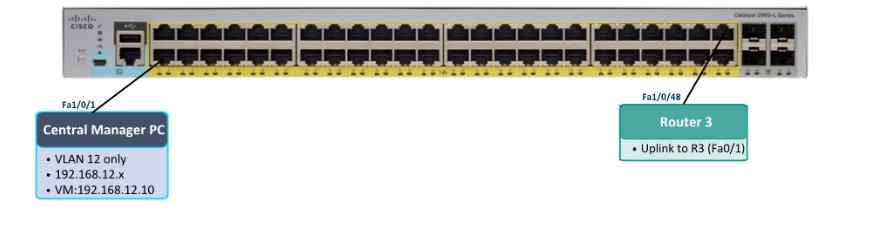

</div>

### VLAN Plan

| VLAN | Subnet | Purpose |
|---|---|---|
| 10 | 192.168.10.0/24 | Student PCs — EDR + NDR auto-deployed |
| 15 | 192.168.15.0/24 | Staff laptops — 802.1X PEAP auth |
| 20 | 192.168.20.0/24 | IoT sensors — Pi static 192.168.20.101 |
| 31 | 192.168.31.0/24 | PAC — Raspberry Pi 5 door controller |
| 40 | 192.168.40.0/24 | Local Managers — Malak's laptop |
| 60 | 192.168.60.0/24 | Server room — VMs 1/2/3, Kafka, LDAP |
| 12 | 192.168.12.0/24 | HQ — Arwa's laptop, central services |

### Routers

<div align="center">

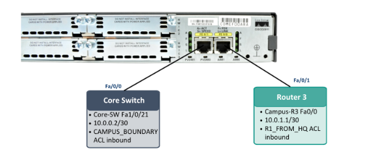

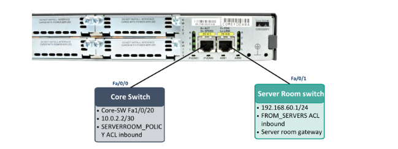

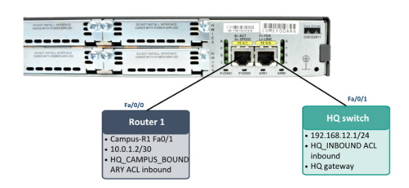

</div>

**R2 DMZ Zone-Based Firewall** enforces: VLAN 31 (PAC) may reach VLAN 60 on port 389 (LDAP) only. HQ (VLAN 12) cannot reach student VLANs (10/15) directly — SOAR isolation goes through Core-SW ACLs, not HQ-to-endpoint SSH. Security-first design: adding SSH from HQ to endpoints would create an attack surface that adds nothing Kafka doesn't already provide.

### 802.1X — Staff Authentication

Staff laptops authenticate via PEAP/MSCHAPv2 against FreeRADIUS on VM2 (192.168.60.11), which proxies LDAP lookup to OpenLDAP (`dc=mass,dc=local`). On success, the switch pushes VLAN 15 via tunnel attributes. Switch configs live in `network/Switches/` and `serverroom/VM2auth-server/`.

---

## Server Room & Infrastructure

Three VMs on Menna's machine, all in VLAN 60 (192.168.60.x):

<div align="center">

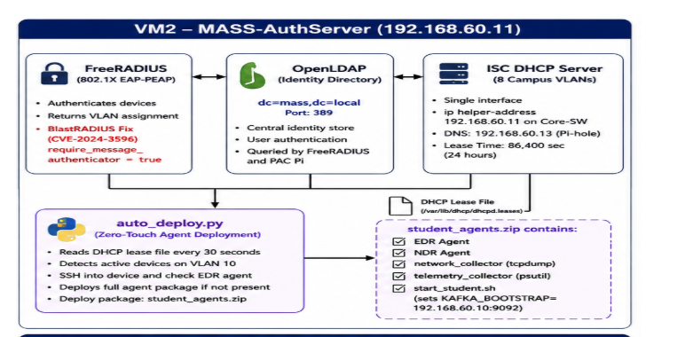

</div>

### VM1 — 192.168.60.10 (Kafka + Services)

```
Services: Apache Kafka + Zookeeper · Mosquitto MQTT · MongoDB
          InfluxDB · PostgreSQL · Grafana
Source:   serverroom/VM1server-room/docker-compose.yml
```

Kafka is the **sole** communication channel between all agents. No agent talks directly to another. This makes the system extensible — a new agent needs only to know which topic to consume from and which to publish to.

<div align="center">

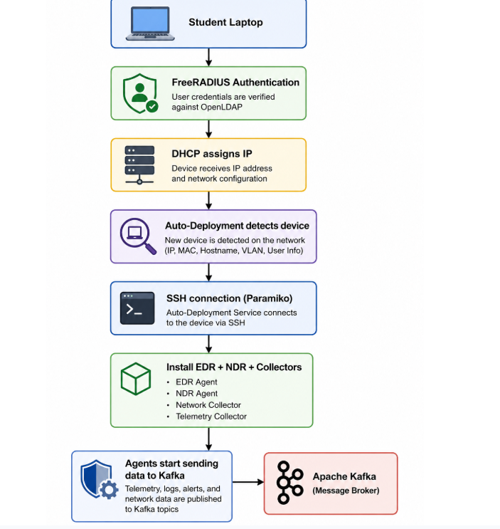

</div>

### VM2 — 192.168.60.11 (Auth + Auto-Deploy)

```
Services: OpenLDAP (dc=mass,dc=local) · FreeRADIUS · ISC DHCP
          auto_deploy.py — pushes EDR/NDR to endpoints every 30s
Source:   serverroom/VM2auth-server/
```

`auto_deploy.py` pings 192.168.10.50, SSHes in, deploys the agent zip, and relaunches via `start_student.sh`. If an attacker kills the agents, they are redeployed in under 30 seconds and the Central Manager fires an agent-down alert within 60 seconds — closing the agent-blinding attack surface.

### VM3 — 192.168.60.13 (Pi-hole DNS)

```
Services: Pi-hole gravity.db (83,496 domains, StevenBlack list)
          DNS for all VLANs via ip helper-address on Core-SW SVIs
```

Pi-hole doubles as a detection vector: NDR Agent fires `dns_tunneling` if any host queries a non-Pi-hole resolver.

<div align="center">

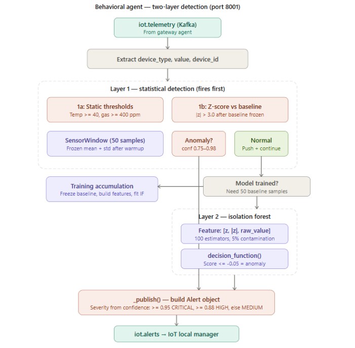

</div>

---

## Hardware — IoT & PAC

### IoT Sensor Node

<div align="center">

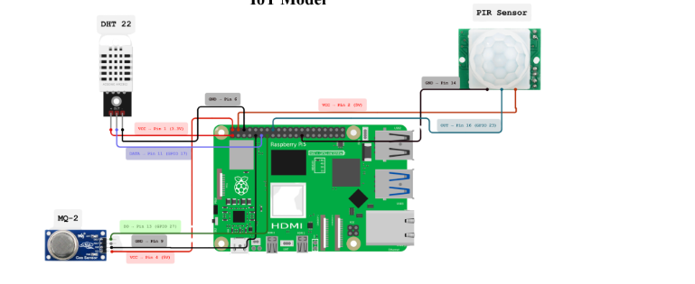

</div>

| Component | Role |
|---|---|
| Raspberry Pi 5 | Edge compute, VLAN 20, static 192.168.20.101 |
| DHT22 | Temperature + humidity → Isolation Forest input |
| MQ-2 | Gas / smoke → anomaly detection |
| PIR sensor | Motion → time-of-day correlation |
| Fire system agent | Emergency response integration |

### Physical Access Control (PAC) Node

<div align="center">

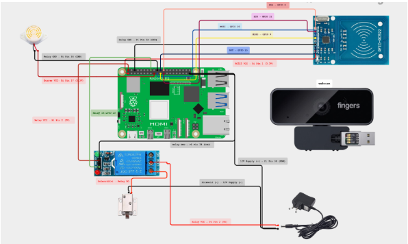

</div>

| Component | Role |
|---|---|
| Raspberry Pi 5 | Door controller, VLAN 31 |
| RC522 RFID reader | SPI — card UIDs SHA-256 hashed before LDAP lookup |
| 12V solenoid lock | Relay-controlled with flyback diode |
| Buzzer | Audible denied-access feedback (non-blocking queue) |
| SW-420 vibration sensor | Physical tamper detection |
| Camera | Headless face recognition via dlib — `camera_agent_headless.py` |

> **Privacy note:** `enroll.py` is committed; biometric face enrollment data (`enrolled_faces.json`) is excluded from this repository (PII). The enrollment workflow is documented in `pi/pac/README.md`.

---

## SOC Dashboards

### HQ Dashboard — `dashboards/hq_dashboard/`

React/JSX single-page application served raw via `server.py` with local React 18.3.1 + Babel 7.29.0 copies (campus VM has no internet). No build step — open `soc_enterprise.html` directly.

**Pages:** Overview · AI Intelligence · Behavioral Timeline · Campus Map · Correlations · SOAR Response · Threat Feed · Forensic · Compliance · Kill Chain · Topology · Digital Twin · Incidents

Live data wiring (5-second poll):

| Panel | Endpoint | Agent |
|---|---|---|
| Threat score, agent health, incidents | `/api/8020/...` | central-manager |
| AI gauges, MITRE radar, Kafka throughput | `/api/8006/health` + `/api/8006/correlations` | analytical-agent |
| SOAR playbooks + executions | `/api/8007/playbooks` | orchestrator-agent |
| ML model precision/recall | `/api/8008/metrics` | learning-agent |

> **Honesty note:** All fake visualizations were removed — geo threat maps attributing attacks to nation-states, hardcoded ML metrics. Every number shown is a real measurement or `not_yet_computed`.

### Local Manager Dashboard — `Local_manager/local_manager.html`

ASTRAL v5 — single-file SOC dashboard served by `server.py` on port 8080. Features: segmented flat angular threat gauge, unified agent discovery across all three domains, agent constellation showing live heartbeat status, geo threat map with demo/replay toggle.

---

## SOAR — Autonomous Response

The Orchestrator Agent selects from five playbooks based on `(confidence × severity × incident_type)`. Playbook selection is **rule-based, not ML** — when a system cuts a user off the network, the decision must be auditable and predictable.

| Playbook | Trigger | Actions |
|---|---|---|
| `intrusion_response` | Confirmed brute force / scan / lateral movement | SSH → Core-SW ACL → isolate IP |
| `data_exfil_response` | ≥ 50 MB outbound flow | Immediate VLAN isolation |
| `physical_breach_response` | Badge cloning / brute-force badge | Lock all doors in zone |
| `iot_tamper_response` | Sensor tamper (Isolation Forest) | Alert + asset quarantine |
| `agent_down_response` | Heartbeat silent > 60s | Alert SOC + trigger VM2 redeploy |

**Two-layer isolation mechanism:**

```
Layer 1 — Switch ACL (Core-SW, Cisco IOS):
  soar_executor.py  →  SSH → Core-SW  →  ip access-list extended ISOLATION
                                          deny ip host <offender> any
  Effect: host loses all campus connectivity within seconds.

Layer 2 — PAC (door locking):
  soar.commands  →  door_process.py on PAC Pi  →  relay de-energized
  Effect: physical zone locked down simultaneously.
```

Every SOAR action is logged to `soar.commands` (Kafka) and confirmed via `soar.responses`. The Forensic Agent automatically assembles a Kafka-replay evidence bundle for every HIGH/CRITICAL incident — covering a configurable time window across all seven relevant topics.

---

## Kafka Event Bus

All 15 agents communicate exclusively through Kafka topics on VM1 (192.168.60.10:9092). No direct agent-to-agent calls exist anywhere in the system.

| Topic | Producer | Consumer | Purpose |
|---|---|---|---|
| `pac.events` | PAC Pi door_process.py | pac-eda-agent, cred-anomaly-agent | Every RFID scan |
| `pac.alerts` | pac-eda-agent | pac-local-manager | Detected PAC threats |
| `pac.incidents` | pac-local-manager | central-manager | Escalated PAC incidents |
| `iot.telemetry` | gateway-agent | behavioral-agent | Sensor readings |
| `iot.alerts` | behavioral-agent | iot-local-manager | Sensor anomalies |
| `iot.incidents` | iot-local-manager | central-manager | Escalated IoT incidents |
| `data.telemetry` | collectors (psutil, tcpdump) | ndr-agent, edr-agent | Flows + process events |
| `data.alerts` | ndr-agent, edr-agent | data-local-manager | Endpoint + network alerts |
| `data.incidents` | data-local-manager | central-manager | Escalated data incidents |
| `hq.incidents` | central-manager | analytical-agent | All incidents at HQ |
| `hq.correlated` | analytical-agent | orchestrator-agent | Correlated multi-domain incidents |
| `soar.commands` | orchestrator-agent, learning-agent | Core-SW, PAC Pi, EDR, NDR | Response commands |
| `soar.responses` | PAC Pi, executor | orchestrator-agent | Command confirmations |
| `agents.heartbeats` | All agents (every 25–30s) | central-manager | Health check + SHA-256 code-hash |
| `ti.enriched` | ti-agent | orchestrator-agent | IOC-enriched alert stream |
| `forensic.evidence` | forensic-agent | — | Evidence bundle metadata |

**Key design decision — why not Suricata as primary detection:** If Suricata did the detection, agents would relay Suricata's findings — the intelligence would belong to Suricata, not to MASS. By detecting from raw telemetry (`psutil` + `tcpdump`), agents own the full detection logic, enabling cross-domain correlation that no IDS can perform.

---

## Deployment — Logical to Physical Map

| Machine | Address | VLAN | Runs |
|---|---|---|---|
| Student PC (Hala) | 192.168.10.50 | 10 | EDR + NDR (auto-deployed) · collectors |
| Menna VM1 | 192.168.60.10 | 60 | Kafka · Mosquitto · gateway-agent · behavioral-agent · pac-eda-agent · cred-anomaly-agent · Mongo · Influx · Postgres · Grafana |
| Menna VM2 | 192.168.60.11 | 60 | OpenLDAP · FreeRADIUS · DHCP · auto_deploy.py |
| Menna VM3 | 192.168.60.13 | 60 | Pi-hole DNS |
| Malak laptop | 192.168.40.10 | 40 | Data/IoT/PAC Local Managers (docker run) · server.py · local_manager.html · soar_executor.py |
| Arwa laptop (HQ) | 192.168.12.10 | 12 | central-manager · analytical-agent · orchestrator-agent · learning-agent · TI agent · forensic-agent · SOC dashboard |
| PAC Pi (RPi 5) | VLAN 31 | 31 | door_process.py · RC522 · relay · buzzer · SW-420 · camera_agent_headless.py |
| IoT Pi (RPi 5) | 192.168.20.101 | 20 | hardware_sensor_reader_v2.py — DHT22 + MQ-2 + PIR |

**Bring-up order** (dependencies matter):

```
1. VM1  — Kafka must be healthy before any agent starts
2. VM2  — LDAP must be up before PAC Pi (RFID card lookup)
3. VM3  — Pi-hole must be up for DNS on all VLANs
4. PAC Pi + IoT Pi
5. Local Managers (Malak laptop)
6. HQ agents (Arwa laptop)
7. Student PC agents — auto-deployed by VM2 when host detected on VLAN 10
```

---

## Getting Started

### Prerequisites

- Docker + Docker Compose
- Python 3.11+
- Campus network access (VLANs as above) or local simulation mode

### Clone and configure

```bash
git clone https://github.com/graduationprojecthm2026-sudo/A-Predictive-Cyber-Physical-Security-System-for-Near-Real-Time-Threat-Detection-and-Autonomous-Cont.git
cd A-Predictive-Cyber-Physical-Security-System-for-Near-Real-Time-Threat-Detection-and-Autonomous-Cont-main
cp .env.example .env
# Fill real values — see .env.example for all required keys (Kafka, LDAP, RADIUS, SSH)
```

### 1. Start infrastructure (VM1 — Menna)

```bash
cd serverroom/VM1server-room
docker-compose up -d
# Confirm Kafka healthy: docker-compose logs -f kafka
```

### 2. Start HQ services (Arwa's laptop)

```bash
cd "HQ (central manager)/docker"
docker-compose up -d
cd ..
python server.py      # :8080 proxy
bash start_hq.sh      # launches all HQ agents
```

### 3. Start Local Managers (Malak's laptop)

```bash
cd Local_manager
bash START_MASS.sh
```

### 4. Start IoT Pi

```bash
# On IoT Pi (192.168.20.101)
cd pi/iot
bash START_MASS.sh
```

### 5. Start PAC Pi

```bash
# On PAC Pi (VLAN 31)
cd pi/pac
bash start_pac.sh
```

### 6. Open dashboards

```
Local SOC:  http://192.168.40.10:8080     (local_manager.html via server.py)
HQ SOC:     open dashboards/hq_dashboard/soc_enterprise.html via HQ server.py
```

---

## Design vs PoC

MASS is a designed system with a demonstrated PoC subset. Both are documented in this repo.

| Dimension | Designed (full system) | Deployed (PoC) |
|---|---|---|
| Agents | 14-agent catalog | **11 agents deployed** |
| Buildings | Full campus, VLANs 10–99 | **HQ + Buildings A & B + passive C + server room** |
| Advanced agents | TI · Forensic · Compliance · Correlation | **TI ✓ · Forensic ✓ · Compliance pending · Correlation dropped (redundant with Analytical)** |

The **Compliance Monitoring Agent** is the remaining component — planned to audit MASS against Egyptian Communications Authority (ECA) requirements, the commercialization target for Egyptian universities and government institutions.

The **Correlation Agent** was dropped by design: auditing its spec against the Analytical Agent's existing capabilities revealed complete overlap. Removing redundancy rather than building duplicate code is the better engineering decision, and is worth stating explicitly.

---

## Team

| Member | Domain | Ownership |
|---|---|---|
| **Hala Soliman** | Data Network | Switch/router configuration · VLANs · ACLs · OSPF · 802.1X switch side · SPAN · system integration |
| **Malak Amgad** | Local Manager + PAC | Tier-2 local managers · SOC local dashboard · SOAR executor · PAC Pi hardware + software · IoT Pi testing |
| **Mena Osman** | Agent Logic + AI | NDR/EDR detection logic · MITRE ATT&CK mapping · learning/unknown-technique similarity · Kafka resilience |
| **Menna Salem** | Infrastructure | All three VMs · Kafka · MQTT · MongoDB/InfluxDB/Postgres · FreeRADIUS · LDAP · DHCP · Pi-hole · auto-deploy |
| **Arwa Ahmed** | HQ Intelligence | Central SOC dashboard · HQ agents (central, analytical, orchestrator, learning, TI, forensic) |


---

<div align="center">

*MASS — Multi-domain Autonomous Security System*
*Galala University · Faculty of Computer Science and Engineering · 2026*
*Supervisor: Prof. Samay Ghoniemy*

</div>
